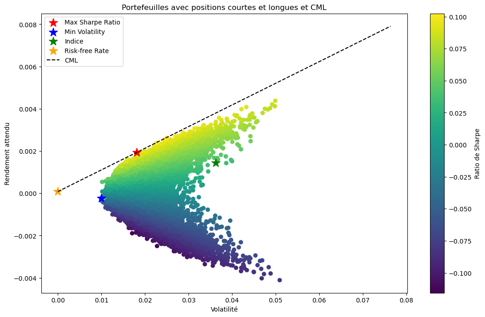

# Markowitz Two-Fund Theorem Applied to Cryptocurrencies

## Overview
This project applies the Markowitz Two-Fund Theorem to the cryptocurrency market, exploring the integration of a risk-free asset with a portfolio of risky assets. Designed as part of a Master's thesis, it seeks to understand the applicability of traditional portfolio optimization theories in the highly volatile cryptocurrency environment.

## Objective
The primary goal is to investigate whether the Markowitz portfolio theory can effectively be applied to cryptocurrencies to achieve an optimal investment portfolio that balances risk and return. This involves:

## Analyzing cryptocurrency data to identify potential investment opportunities.
Applying the Markowitz Two-Fund Theorem to construct portfolios with varying risk profiles.
Comparing the performance of these portfolios against a custom-built cryptocurrency index.

## Methodology
The methodology encompasses several key steps:

**Data Preparation**: Cleaning and preprocessing of cryptocurrency market data.  
**Statistical Analysis**: Calculation of returns, volatilities, correlations, and distribution of returns for selected cryptocurrencies.  
**Portfolio Optimization**:  
Utilizing the Markowitz model to derive the efficient frontier for portfolios consisting solely of long positions.  
Extending the analysis to include both long and short positions within the portfolios.  
**Capital Market Line (CML) Construction**: Determining the CML to illustrate optimal portfolio selection based on individual risk tolerance.  
**Index Creation**: Developing a bespoke cryptocurrency index for benchmarking the optimal portfolio's performance.

